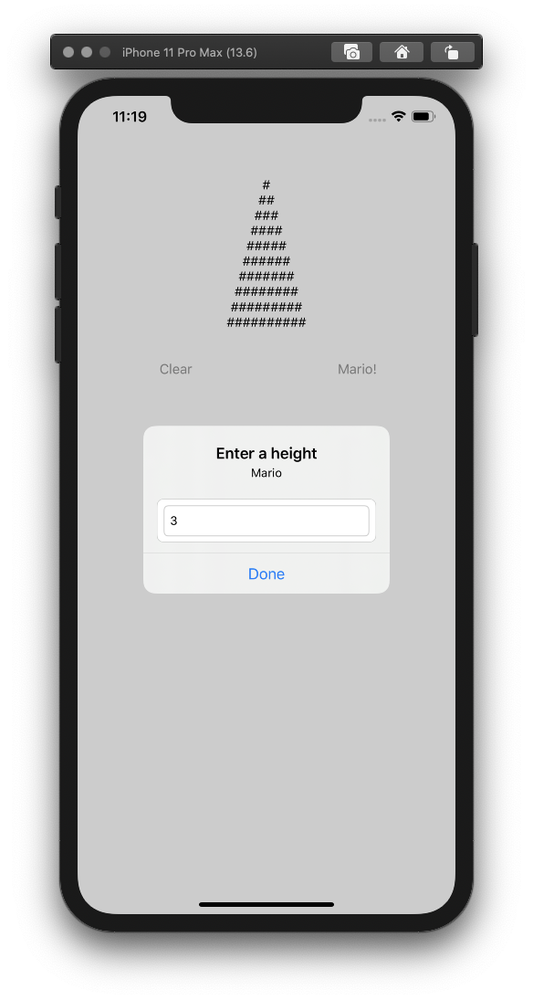

# ios-learn-objective-c
Many companies still using Objective-C as their main code or libraries. So it doesn't feel discouraged or too late to start learning Objective-C now, right?

### 1. Learning iOS: Create your own app with Objective-C! by Tianyu Liu
Learn basic Objective-C, how to create variable and function. Play with Storyboard using IBOutlet and IBAction, also AutoLayout and StackView. Doing dynamic interaction data with AlertController to change the height of the pyramid. A very good explanation to get the basic knowledge of Objective-C. 
* You can check the full tutorial [here](https://www.youtube.com/watch?v=ZeXSPJfsNPE). 
&nbsp;
&nbsp;
&nbsp;
